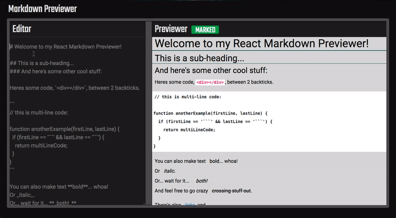

# Draggable Markdown Previewer

> This is one simple *React* project on [freeCodeCamp.org](https://www.freecodecamp.org/), and I tried to add some additional features to it.</br>
DEMO website here :arrow_right: https://chienchenglin.github.io/draggable-markdown-previewer/ :arrow_left:

## Languages & Tools
- HTML / CSS / JavaScript
- React.js / Babel / SCSS
- Webpack / npm

## Structure
```
./draggable-markdown-previewer
├── .babelrc
├── .gitignore
├── README-src
├── README.md
├── package-lock.json
├── package.json
├── webpack.config.js
├── dist
│   ├── index.bundle.js
│   └── index.html
├── src
│   ├── index.html
│   ├── index.js
│   └── style.scss
```


### :point_down: You Can :point_down:
- #### Edit your markdown syntax in Editor, and check out the result in Previewer


- #### Click the MARKED/SOURCE button to switch the preview mode between markdown and HTML source


- #### Drag the bar to resize the Editor/Previewer

